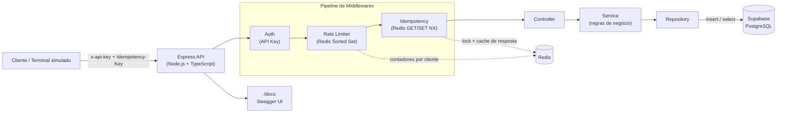
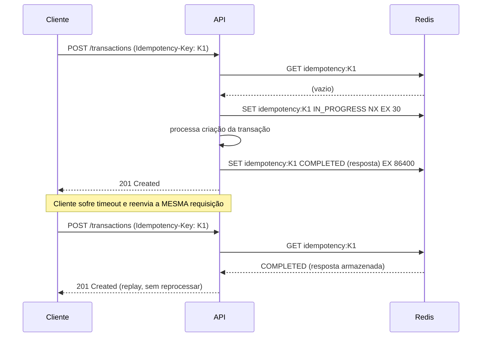

# 💳 Transactions API — Idempotência & Rate Limiting

[](https://github.com/SEU-USUARIO/transactions-api/actions/workflows/ci.yml)
[](https://nodejs.org)
[](https://www.typescriptlang.org)
[](https://redis.io)
[](https://supabase.com)
[](./LICENSE)

Microserviço de portfólio: uma **API de Transações** que demonstra, na prática, dois
padrões essenciais de APIs financeiras/production-grade:

- **Idempotência** via header `Idempotency-Key` — retries do cliente nunca duplicam uma operação.
- **Rate Limiting** distribuído via Redis (sliding window log) — protege a API contra abuso.

> Projeto criado para ser consumido por um terminal simulado no meu one-page de portfólio.

---

## 📐 Arquitetura



### Fluxo de idempotência



---

## ✨ Funcionalidades

- ✅ CRUD de transações (`create`, `get`, `list` paginado) persistidas no **Supabase**.
- ✅ **Idempotência**: mesma `Idempotency-Key` + mesmo corpo → resposta replayada; corpo
  diferente → `422`; requisição concorrente ainda em andamento → `409`.
- ✅ **Rate Limiting** distribuído por cliente (API key/IP), com headers `X-RateLimit-*` e `Retry-After`.
- ✅ Autenticação simples via `x-api-key`.
- ✅ Validação de payload com **Zod**.
- ✅ Documentação interativa com **Swagger UI** (`/docs`) + OpenAPI JSON (`/docs.json`).
- ✅ Logs estruturados com **Pino**.
- ✅ **Docker** + **docker-compose** (API + Redis) prontos para rodar localmente.
- ✅ **Testes unitários** (Jest + Supertest + ioredis-mock) cobrindo idempotência, rate limit e regras de negócio.
- ✅ **CI/CD** com GitHub Actions: lint → typecheck → testes com cobertura → build → build da imagem Docker.

---

## 🛠️ Stack técnica

| Camada          | Tecnologia                             |
|------------------|-----------------------------------------|
| Linguagem        | Node.js 20 + TypeScript 5               |
| Framework HTTP   | Express                                 |
| Banco de dados   | Supabase (PostgreSQL)                   |
| Cache / Locks    | Redis (ioredis)                         |
| Validação        | Zod                                     |
| Documentação     | swagger-jsdoc + swagger-ui-express      |
| Testes           | Jest, Supertest, ioredis-mock           |
| Containerização  | Docker (multi-stage) + docker-compose   |
| CI/CD            | GitHub Actions                          |

---

## 🚀 Como rodar

### Pré-requisitos
- Node.js 20+
- Docker e Docker Compose
- Uma conta [Supabase](https://supabase.com) (gratuita) com o schema em `supabase/migrations/0001_create_transactions.sql` aplicado

### 1. Clonar e configurar

```bash
git clone https://github.com/SEU-USUARIO/transactions-api.git
cd transactions-api
cp .env.example .env
# edite o .env com sua SUPABASE_URL, SUPABASE_SECRET_KEY e uma API_KEY própria
```

### 2. Rodar com Docker (recomendado)

```bash
docker compose up --build
```

A API sobe em `http://localhost:3000`, com Redis já configurado como serviço.

### 3. Rodar localmente (sem Docker)

```bash
npm install
# suba um Redis local, ex: docker run -p 6379:6379 redis:7-alpine
npm run dev
```

### 4. Documentação interativa

Com o servidor rodando, acesse:

```
http://localhost:3000/docs
```

---

## 📡 Endpoints

Todas as rotas abaixo exigem o header `x-api-key`.

| Método | Rota                     | Descrição                                   | Headers extras                |
|--------|---------------------------|----------------------------------------------|--------------------------------|
| POST   | `/api/v1/transactions`     | Cria uma transação                           | `Idempotency-Key` (obrigatório)|
| GET    | `/api/v1/transactions/:id` | Busca uma transação pelo ID                  | —                               |
| GET    | `/api/v1/transactions`     | Lista transações (`?page=&pageSize=`)        | —                               |
| GET    | `/health`                  | Health check                                 | —                               |
| GET    | `/docs`                    | Swagger UI                                   | —                               |

### Exemplo — criar transação

```bash
curl -X POST http://localhost:3000/api/v1/transactions \
  -H "Content-Type: application/json" \
  -H "x-api-key: SUA_API_KEY" \
  -H "Idempotency-Key: 3f2504e0-4f89-11ee-be56-0242ac120002" \
  -d '{
    "type": "DEPOSIT",
    "amount": 250.50,
    "currency": "BRL",
    "description": "Depósito inicial"
  }'
```

Reenviar a **mesma requisição exata** (mesma `Idempotency-Key` e mesmo corpo) retorna a
mesma resposta, sem criar uma segunda transação — o header `Idempotent-Replay: true`
é adicionado na resposta de replay.

---

## 🧪 Testes

```bash
npm test           # roda os testes com relatório de cobertura
npm run test:watch # modo watch durante o desenvolvimento
```

Cobertura atual:
- Middleware de idempotência: replay, corpo divergente (422), concorrência (409).
- Middleware de rate limiting: bloqueio ao exceder limite, headers `X-RateLimit-*`, reset da janela.
- Serviço de transações: regras de negócio e paginação.

## 🔄 CI/CD

O workflow em [`.github/workflows/ci.yml`](.github/workflows/ci.yml) roda a cada push/PR na `main`:

1. Instala dependências (`npm ci`)
2. Auditoria de vulnerabilidades (`npm audit --audit-level=high`)
3. Lint (`eslint`)
4. Checagem de tipos (`tsc --noEmit`)
5. Testes unitários com cobertura, usando um Redis efêmero como *service container*
6. Build de produção (`tsc`)
7. Build da imagem Docker

O status é refletido no badge **CI** no topo deste README.

---

## 📁 Estrutura do projeto

```
transactions-api/
├── src/
│   ├── config/         # env, redis, supabase, logger
│   ├── middlewares/     # auth, idempotency, rateLimiter, errorHandler
│   ├── routes/           # rotas + anotações Swagger
│   ├── controllers/      # camada HTTP
│   ├── services/         # regras de negócio
│   ├── repositories/     # acesso ao Supabase
│   ├── docs/              # swagger.ts
│   └── types/              # tipos e schemas zod
├── tests/unit/             # testes Jest
├── supabase/migrations/     # schema SQL
├── .github/workflows/ci.yml  # pipeline CI/CD
├── Dockerfile
├── docker-compose.yml
└── README.md
```

---

## 🗺️ Roadmap (ideias futuras)

- [ ] Autenticação via JWT/OAuth em vez de API key estática
- [ ] Webhooks de notificação de status de transação
- [ ] Suporte a estorno (`REVERSAL`)
- [ ] Deploy automatizado (Railway/Fly.io) no pipeline de CI/CD

## 🔧 Manutenção de dependências

Para evitar os avisos clássicos de `npm install` (`deprecated`, dependências
transitivas antigas) e reduzir superfície de vulnerabilidades:

- **[Dependabot](.github/dependabot.yml)** está configurado para abrir PRs semanais
  (toda segunda-feira) atualizando dependências npm, a imagem base do `Dockerfile`
  e as GitHub Actions usadas no CI. Atualizações de patch/minor vêm agrupadas em
  um único PR; major versions vêm separadas para revisão manual.
- O CI roda **`npm audit --audit-level=high`** a cada push/PR, falhando o pipeline
  se surgir uma vulnerabilidade real de severidade alta ou crítica.
- O `Dockerfile` usa `npm ci --omit=dev` no estágio de produção, então nenhuma
  `devDependency` (eslint, jest, ts-jest, etc.) vai parar na imagem final.

**Decisões tomadas para eliminar os warnings originais:**

| Antes | Depois | Motivo |
|---|---|---|
| `eslint@8` + `.eslintrc.json` | `eslint@10` + `eslint.config.js` (flat config) | ESLint 8 puxava `@humanwhocodes/*`, `rimraf@3` e `glob@7`, todos descontinuados |
| `@typescript-eslint/*@7` (dois pacotes) | `typescript-eslint@8` (pacote unificado) | Simplifica o parser/plugin em um só pacote, compatível com ESLint 9/10 |
| `ts-node-dev` | `tsx` | `ts-node-dev` dependia de `rimraf@2.7.1` → `glob@7` → `inflight@1.0.6` (não mantido); `tsx` é atualmente a ferramenta padrão da comunidade, sem essa cadeia legada |
| `jest@29` | `jest@30` | Passou a usar `glob@13` internamente em vez de `glob@7` |
| `uuid` (dependência não utilizada) | *(removida)* | O `id` da transação é gerado pelo Postgres/Supabase (`uuid_generate_v4()`); o pacote nunca era importado no código |

Depois dessas mudanças, `npm install` fica só com 2 avisos residuais (de
`swagger-jsdoc` e `babel-plugin-istanbul`, que ainda não migraram sua
dependência interna de `glob`) — confirmados via `npm audit` como **0
vulnerabilidades conhecidas**, inclusive em `npm audit --omit=dev` (o cenário
real de produção).

Para checar o estado das dependências a qualquer momento:

```bash
npm outdated   # o que está desatualizado
npm audit      # vulnerabilidades conhecidas
```

## 📄 Licença

MIT — sinta-se livre para usar este projeto como referência.
